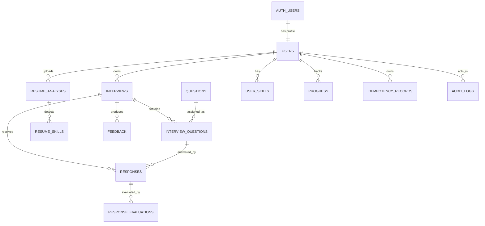

# P1.3 — COMPLETE BACKEND DATABASE DESIGN

## P1.3.1 Database Design Principles

### PostgreSQL Schema
* **auth**: Supabase-managed schema for authentication identities (e.g., `auth.users`).
* **public**: Application-managed schema for all platform data.

### Authentication Profile Separation
* `public.users.id` explicitly references `auth.users.id` in a 1:1 relationship.
* No separate or unrelated UUIDs are created for user profiles.

### Identifier Standard
* All public resource identifiers use UUIDs.
* Pattern: `id uuid primary key default gen_random_uuid()`
* Exception: `public.users.id` is populated directly from `auth.users.id`.

### Timestamp Standard
* Data type: `timestamptz` (ISO 8601 UTC).
* Common columns include `created_at`, `updated_at`, `deleted_at`. Backend strictly manages these via database defaults or backend logic, ignoring frontend inputs.

### Naming Standard
* Database schema strictly uses `snake_case` (e.g., `interview_questions`, `created_at`).
* The API response serialization layer maps these to `camelCase` (e.g., `interviewQuestions`, `createdAt`).

### Ownership Standard
* Every user-owned resource either directly holds `user_id` or guarantees a secure ownership path (e.g., `response -> interview -> user`). Direct `user_id` denormalization is used on heavily queried tables to simplify RLS and filtering.

### Normalization
* Use relational tables for predictable entities.
* `JSONB` is restricted to highly flexible and nested AI outputs (e.g., detailed feedback strings, structured result trees) without polluting the normalized schema.

---

## P1.3.2 Domain Entities and Ownership

The core entities modeled in the system are:
* **User Profile** (`users`): Root owner of all resources.
* **Question Bank** (`questions`): Global and AI-generated questions.
* **Mock Interview** (`interviews`): Configured mock sessions owned by users.
* **Interview Assignments** (`interview_questions`): Snapshots of questions assigned to an interview.
* **Student Responses** (`responses`): Submitted answers during a mock session.
* **AI Evaluations** (`response_evaluations`): Scoring records for individual responses.
* **Resume Analysis** (`resume_analyses`): Uploaded document metadata and AI extraction output.
* **Skills** (`resume_skills`, `user_skills`): Normalized tracking of competencies.
* **Aggregates** (`progress`, `feedback`): Long-term tracking and final interview readouts.
* **System** (`idempotency_records`, `audit_logs`): Operational safety and security tracking.

---

## P1.3.3 Enums and Controlled Values

All enums will be implemented natively using PostgreSQL `CREATE TYPE ... AS ENUM` for optimal storage and data integrity.

* **Account Status** (`account_status_enum`): `active`, `suspended`, `deletion_pending`, `deleted`
* **Experience Level** (`experience_level_enum`): `fresher`, `beginner`, `intermediate`, `advanced`
* **Question Type** (`question_type_enum`): `technical`, `aptitude`, `behavioral`, `hr`, `coding`, `system_design`
* **Question Difficulty** (`difficulty_enum`): `easy`, `medium`, `hard`
* **Question Source** (`question_source_enum`): `curated`, `admin_created`, `ai_generated`
* **Interview Type** (`interview_type_enum`): `technical`, `aptitude`, `behavioral`, `hr`, `mixed`
* **Interview Status** (`interview_status_enum`): `draft`, `generating`, `ready`, `in_progress`, `completed`, `cancelled`, `failed`
  * Valid transitions: `draft → generating → ready|failed`, `ready → in_progress|cancelled`, `in_progress → completed|cancelled`
* **Evaluation Status** (`evaluation_status_enum`): `pending`, `processing`, `completed`, `failed`
* **Resume-Analysis Status** (`resume_status_enum`): `uploaded`, `extracting`, `analyzing`, `completed`, `failed`, `deleted`
* **Skill Source** (`skill_source_enum`): `profile`, `resume`, `interview`, `system_inferred`
* **Progress Dimension** (`progress_dimension_enum`): `overall`, `category`, `skill`, `difficulty`, `interview_type`
* **Idempotency Status** (`idempotency_status_enum`): `processing`, `completed`, `failed`

---

## P1.3.4 Complete Table Specifications

### Table: users
**Purpose:** Profile data directly linked to Supabase Auth.
**Ownership:** Direct (`id` = `auth.uid()`)

| Column | PostgreSQL type | Nullable | Default | Key | Description |
|---|---|---:|---|---|---|
| id | uuid | No | - | PK/FK | Matches auth.users.id |
| email | varchar(255) | No | - | - | Duplicated for join-free queries. Synced via trigger. |
| full_name | varchar(100) | No | - | - | Display name |
| college | varchar(150) | Yes | - | - | - |
| branch | varchar(100) | Yes | - | - | - |
| graduation_year | integer | Yes | - | - | e.g., 2026 |
| experience_level | experience_level_enum | Yes | - | - | - |
| preferred_roles | text[] | Yes | '{}' | - | Array of target roles |
| bio | varchar(500) | Yes | - | - | - |
| avatar_url | text | Yes | - | - | - |
| account_status | account_status_enum | No | 'active' | - | - |
| created_at | timestamptz | No | now() | - | - |
| updated_at | timestamptz | No | now() | - | - |
| deleted_at | timestamptz | Yes | null | - | Soft delete flag |

**Constraints:** `graduation_year` BETWEEN 2000 AND 2100.
**RLS:** `id = auth.uid()`

---

### Table: questions
**Purpose:** Global question bank for mock interviews.
**Ownership:** System/Admin. AI-generated questions mapped to system pseudo-user or null.

| Column | PostgreSQL type | Nullable | Default | Key | Description |
|---|---|---:|---|---|---|
| id | uuid | No | gen_random_uuid() | PK | - |
| question_text | text | No | - | - | Max 2000 chars |
| question_type | question_type_enum | No | - | - | - |
| category | varchar(100) | No | - | - | E.g., Frontend, Database |
| difficulty | difficulty_enum | No | - | - | - |
| skill | varchar(100) | Yes | - | - | E.g., React, PostgreSQL |
| expected_keywords | text[] | Yes | '{}' | - | For evaluation |
| reference_answer | text | Yes | - | - | Not visible to users |
| source | question_source_enum | No | 'curated' | - | - |
| created_by | uuid | Yes | null | FK | Admin or user ID if applicable |
| is_active | boolean | No | true | - | - |
| metadata | jsonb | Yes | '{}' | - | - |
| created_at | timestamptz | No | now() | - | - |
| updated_at | timestamptz | No | now() | - | - |
| deleted_at | timestamptz | Yes | null | - | Soft delete |

**RLS:** `PUBLIC_READ` for active questions, `ADMIN_ONLY` for writes.

---

### Table: interviews
**Purpose:** Mock interview sessions.
**Ownership:** Direct via `user_id`.

| Column | PostgreSQL type | Nullable | Default | Key | Description |
|---|---|---:|---|---|---|
| id | uuid | No | gen_random_uuid() | PK | - |
| user_id | uuid | No | - | FK | Owner |
| title | varchar(100) | No | - | - | - |
| interview_type | interview_type_enum | No | - | - | - |
| difficulty | difficulty_enum | No | - | - | - |
| target_role | varchar(100) | Yes | - | - | - |
| question_count | integer | No | 5 | - | Max 20 |
| time_limit_minutes | integer | Yes | null | - | - |
| question_source | question_source_enum | No | 'ai_generated' | - | - |
| status | interview_status_enum | No | 'draft' | - | - |
| current_question_order | integer | No | 1 | - | Iterator |
| overall_score | numeric(5,2) | Yes | null | - | 0-100 |
| version | integer | No | 1 | - | Optimistic lock |
| started_at | timestamptz | Yes | null | - | - |
| completed_at | timestamptz | Yes | null | - | - |
| cancelled_at | timestamptz | Yes | null | - | - |
| failure_code | varchar(50) | Yes | null | - | Safe error code |
| created_at | timestamptz | No | now() | - | - |
| updated_at | timestamptz | No | now() | - | - |
| deleted_at | timestamptz | Yes | null | - | Soft delete |

**Constraints:** `overall_score` BETWEEN 0 AND 100. `question_count` BETWEEN 1 AND 20.
**RLS:** `user_id = auth.uid()`

---

### Table: interview_questions
**Purpose:** Stable snapshot of assigned questions.
**Ownership:** Path via `interview_id`.

| Column | PostgreSQL type | Nullable | Default | Key | Description |
|---|---|---:|---|---|---|
| id | uuid | No | gen_random_uuid() | PK | - |
| interview_id | uuid | No | - | FK | - |
| question_id | uuid | Yes | null | FK | Null if ad-hoc AI generated |
| question_text_snapshot | text | No | - | - | Immutable |
| question_type_snapshot | question_type_enum | No | - | - | Immutable |
| category_snapshot | varchar(100) | No | - | - | Immutable |
| difficulty_snapshot | difficulty_enum | No | - | - | Immutable |
| skill_snapshot | varchar(100) | Yes | - | - | Immutable |
| expected_keywords_snapshot | text[] | Yes | '{}' | - | Immutable |
| display_order | integer | No | - | - | 1 to question_count |
| time_limit_seconds | integer | Yes | null | - | - |
| created_at | timestamptz | No | now() | - | - |

**Unique constraints:** `(interview_id, display_order)`.
**RLS:** `interview_id IN (SELECT id FROM interviews WHERE user_id = auth.uid())`

---

### Table: responses
**Purpose:** Submitted answers.
**Ownership:** Direct via `user_id`.

| Column | PostgreSQL type | Nullable | Default | Key | Description |
|---|---|---:|---|---|---|
| id | uuid | No | gen_random_uuid() | PK | - |
| interview_id | uuid | No | - | FK | - |
| interview_question_id | uuid | No | - | FK | - |
| user_id | uuid | No | - | FK | Redundant for fast RLS |
| answer_text | text | No | - | - | Max 5000 chars |
| time_spent_seconds | integer | No | - | - | >= 0 |
| submission_number | integer | No | 1 | - | Iterates on retry |
| idempotency_key | uuid | Yes | null | - | - |
| submitted_at | timestamptz | No | now() | - | - |
| created_at | timestamptz | No | now() | - | - |
| updated_at | timestamptz | No | now() | - | - |
| deleted_at | timestamptz | Yes | null | - | Soft delete |

**Unique constraints:** `(interview_question_id, submission_number)`
**RLS:** `user_id = auth.uid()`

---

### Table: response_evaluations
**Purpose:** AI evaluation results for answers.
**Ownership:** Path via `response_id`.

| Column | PostgreSQL type | Nullable | Default | Key | Description |
|---|---|---:|---|---|---|
| id | uuid | No | gen_random_uuid() | PK | - |
| response_id | uuid | No | - | FK | - |
| attempt_number | integer | No | 1 | - | - |
| provider | varchar(50) | No | - | - | e.g. gemini, openai |
| model | varchar(50) | No | - | - | e.g. gemini-1.5-pro |
| status | evaluation_status_enum| No | 'pending' | - | - |
| is_current | boolean | No | true | - | Only one true per response |
| overall_score | numeric(5,2) | Yes | null | - | 0-100 |
| technical_accuracy | numeric(5,2) | Yes | null | - | 0-100 |
| communication_score | numeric(5,2) | Yes | null | - | 0-100 |
| completeness_score | numeric(5,2) | Yes | null | - | 0-100 |
| strengths | text[] | Yes | '{}' | - | - |
| weaknesses | text[] | Yes | '{}' | - | - |
| suggestions | text[] | Yes | '{}' | - | - |
| structured_result | jsonb | Yes | '{}' | - | Extended AI schema |
| raw_result | jsonb | Yes | null | - | Expiration/TTL candidate |
| provider_request_id | varchar(100) | Yes | null | - | - |
| prompt_version | varchar(50) | No | '1.0' | - | - |
| error_code | varchar(50) | Yes | null | - | Safe string |
| error_message_safe | text | Yes | null | - | Sanitized output |
| started_at | timestamptz | Yes | null | - | - |
| completed_at | timestamptz | Yes | null | - | - |
| created_at | timestamptz | No | now() | - | - |

**Unique constraints:** Partial index ensuring only one `is_current = true` per `response_id`.
**RLS:** `response_id IN (SELECT id FROM responses WHERE user_id = auth.uid())`

---

### Table: resume_analyses
**Purpose:** Resume file records and AI extractions.
**Ownership:** Direct via `user_id`.

| Column | PostgreSQL type | Nullable | Default | Key | Description |
|---|---|---:|---|---|---|
| id | uuid | No | gen_random_uuid() | PK | - |
| user_id | uuid | No | - | FK | - |
| original_filename | varchar(255) | No | - | - | - |
| storage_bucket | varchar(50) | No | 'resumes' | - | - |
| storage_path | varchar(500) | No | - | - | Private URL path |
| mime_type | varchar(100) | No | - | - | pdf or docx |
| file_size_bytes | integer | No | - | - | <= 5242880 |
| file_hash | varchar(64) | No | - | - | SHA256 for dupe checks |
| status | resume_status_enum | No | 'uploaded' | - | - |
| extracted_text | text | Yes | null | - | Retained until analysis completes |
| overall_score | numeric(5,2) | Yes | null | - | 0-100 |
| detected_skills | text[] | Yes | '{}' | - | - |
| missing_skills | text[] | Yes | '{}' | - | - |
| strengths | text[] | Yes | '{}' | - | - |
| weaknesses | text[] | Yes | '{}' | - | - |
| recommendations | jsonb | Yes | '{}' | - | - |
| ats_suggestions | jsonb | Yes | '{}' | - | - |
| role_match | jsonb | Yes | '{}' | - | - |
| provider | varchar(50) | Yes | null | - | - |
| model | varchar(50) | Yes | null | - | - |
| prompt_version | varchar(50) | Yes | null | - | - |
| error_code | varchar(50) | Yes | null | - | - |
| started_at | timestamptz | Yes | null | - | - |
| completed_at | timestamptz | Yes | null | - | - |
| created_at | timestamptz | No | now() | - | - |
| updated_at | timestamptz | No | now() | - | - |
| deleted_at | timestamptz | Yes | null | - | Soft delete |

**RLS:** `user_id = auth.uid()`

---

### Table: resume_skills
**Purpose:** Normalized skills detected in a resume.
**Ownership:** Path via `resume_analysis_id`.

| Column | PostgreSQL type | Nullable | Default | Key | Description |
|---|---|---:|---|---|---|
| id | uuid | No | gen_random_uuid() | PK | - |
| resume_analysis_id | uuid | No | - | FK | - |
| skill_name | varchar(100) | No | - | - | Original casing |
| normalized_skill_key | varchar(100) | No | - | - | Lowercase/slug |
| skill_type | varchar(50) | Yes | null | - | soft, technical |
| confidence_score | numeric(5,2) | Yes | null | - | 0-100 |
| created_at | timestamptz | No | now() | - | - |

**Unique constraints:** `(resume_analysis_id, normalized_skill_key)`
**RLS:** Check `resume_analyses.user_id = auth.uid()`

---

### Table: user_skills
**Purpose:** Long-term competency tracking.
**Ownership:** Direct via `user_id`.

| Column | PostgreSQL type | Nullable | Default | Key | Description |
|---|---|---:|---|---|---|
| id | uuid | No | gen_random_uuid() | PK | - |
| user_id | uuid | No | - | FK | - |
| skill_name | varchar(100) | No | - | - | Original casing |
| normalized_skill_key | varchar(100) | No | - | - | Canonical ID |
| proficiency_level | numeric(5,2) | Yes | null | - | 0-100 (aggregated) |
| source | skill_source_enum | No | 'system_inferred' | - | - |
| confidence_score | numeric(5,2) | Yes | null | - | 0-100 |
| last_evaluated_at | timestamptz | No | now() | - | - |
| created_at | timestamptz | No | now() | - | - |
| updated_at | timestamptz | No | now() | - | - |

**Unique constraints:** `(user_id, normalized_skill_key, source)`. Allow multiple evidence sources per skill per user to calculate aggregate weighted proficiency.

---

### Table: progress
**Purpose:** Backend-calculated performance aggregations.
**Ownership:** Direct via `user_id`.

| Column | PostgreSQL type | Nullable | Default | Key | Description |
|---|---|---:|---|---|---|
| id | uuid | No | gen_random_uuid() | PK | - |
| user_id | uuid | No | - | FK | - |
| dimension_type | progress_dimension_enum | No | - | - | 'overall', 'category', 'skill' |
| dimension_key | varchar(100) | No | 'global' | - | Defines specific skill or category name |
| attempt_count | integer | No | 0 | - | >= 0 |
| average_score | numeric(5,2) | No | 0.0 | - | 0-100 |
| highest_score | numeric(5,2) | No | 0.0 | - | 0-100 |
| latest_score | numeric(5,2) | No | 0.0 | - | 0-100 |
| trend | numeric(5,2) | Yes | null | - | Positive/Negative momentum |
| last_attempted_at | timestamptz | Yes | null | - | - |
| created_at | timestamptz | No | now() | - | - |
| updated_at | timestamptz | No | now() | - | - |

**Constraints:** `highest_score >= average_score`. `attempt_count >= 0`. Unique: `(user_id, dimension_type, dimension_key)`

---

### Table: feedback
**Purpose:** Comprehensive readout per interview.
**Ownership:** Direct via `user_id` and path via `interview_id`.

| Column | PostgreSQL type | Nullable | Default | Key | Description |
|---|---|---:|---|---|---|
| id | uuid | No | gen_random_uuid() | PK | - |
| user_id | uuid | No | - | FK | Redundant for fast reads |
| interview_id | uuid | No | - | FK | - |
| version | integer | No | 1 | - | Auto-increments |
| is_current | boolean | No | true | - | - |
| strengths | text[] | Yes | '{}' | - | - |
| weaknesses | text[] | Yes | '{}' | - | - |
| priority_improvements | text[] | Yes | '{}' | - | - |
| recommended_topics | text[] | Yes | '{}' | - | - |
| learning_plan | jsonb | Yes | '{}' | - | Rich AI object |
| next_interview_difficulty | difficulty_enum | Yes | null | - | AI suggestion |
| provider | varchar(50) | No | - | - | - |
| model | varchar(50) | No | - | - | - |
| prompt_version | varchar(50) | No | '1.0' | - | - |
| created_at | timestamptz | No | now() | - | - |

**Unique Constraints:** `(interview_id, version)` and partial unique `(interview_id)` where `is_current = true`.

---

### Table: idempotency_records
**Purpose:** Protects critical actions (e.g., complete_interview, AI evaluations) from network retry double-execution.
**Ownership:** Direct via `user_id`.

| Column | PostgreSQL type | Nullable | Default | Key | Description |
|---|---|---:|---|---|---|
| id | uuid | No | gen_random_uuid() | PK | - |
| user_id | uuid | No | - | FK | - |
| idempotency_key | varchar(255) | No | - | - | Client provided |
| operation | varchar(100) | No | - | - | 'submit_response', 'complete_interview' |
| request_hash | varchar(64) | No | - | - | Verifies payload matches |
| status | idempotency_status_enum | No | 'processing'| - | - |
| resource_type | varchar(100) | Yes | null | - | e.g. 'interview' |
| resource_id | uuid | Yes | null | - | e.g. interview_id |
| response_status | integer | Yes | null | - | Saved HTTP code |
| response_body | jsonb | Yes | null | - | Saved JSON |
| locked_until | timestamptz | Yes | null | - | For optimistic locks |
| expires_at | timestamptz | No | - | - | TTL (e.g. 24h) |
| created_at | timestamptz | No | now() | - | - |
| updated_at | timestamptz | No | now() | - | - |

**Unique constraint:** `(user_id, operation, idempotency_key)`.

---

### Table: audit_logs
**Purpose:** System tracing and accountability.
**Ownership:** Path via `actor_user_id` (system acts on user's behalf sometimes).

| Column | PostgreSQL type | Nullable | Default | Key | Description |
|---|---|---:|---|---|---|
| id | uuid | No | gen_random_uuid() | PK | - |
| actor_user_id | uuid | Yes | null | FK | Null if system/cron |
| actor_type | varchar(50) | No | 'user' | - | 'user', 'admin', 'system' |
| action | varchar(100) | No | - | - | 'ACCOUNT_DELETED', etc. |
| resource_type | varchar(100) | No | - | - | 'user', 'interview' |
| resource_id | uuid | Yes | null | - | - |
| metadata | jsonb | Yes | '{}' | - | Changes/context (no secrets) |
| request_id | uuid | Yes | null | - | Ties to API log |
| ip_address | inet | Yes | null | - | - |
| user_agent | text | Yes | null | - | - |
| created_at | timestamptz | No | now() | - | Append only |

---

## P1.3.5 Relationships and Foreign Keys

All foreign keys use explicit referential actions to prevent implicit defaults.

* `users.id` -> `auth.users.id` (ON DELETE CASCADE)
* `interviews.user_id` -> `users.id` (ON DELETE CASCADE)
* `interview_questions.interview_id` -> `interviews.id` (ON DELETE CASCADE)
* `interview_questions.question_id` -> `questions.id` (ON DELETE SET NULL) *Ensures historic text snapshot is kept even if global question is removed.*
* `responses.interview_id` -> `interviews.id` (ON DELETE CASCADE)
* `responses.interview_question_id` -> `interview_questions.id` (ON DELETE CASCADE)
* `responses.user_id` -> `users.id` (ON DELETE CASCADE)
* `response_evaluations.response_id` -> `responses.id` (ON DELETE CASCADE)
* `resume_analyses.user_id` -> `users.id` (ON DELETE CASCADE)
* `resume_skills.resume_analysis_id` -> `resume_analyses.id` (ON DELETE CASCADE)
* `user_skills.user_id` -> `users.id` (ON DELETE CASCADE)
* `progress.user_id` -> `users.id` (ON DELETE CASCADE)
* `feedback.interview_id` -> `interviews.id` (ON DELETE CASCADE)
* `feedback.user_id` -> `users.id` (ON DELETE CASCADE)
* `idempotency_records.user_id` -> `users.id` (ON DELETE CASCADE)
* `audit_logs.actor_user_id` -> `users.id` (ON DELETE SET NULL) *Preserves audit history.*

---

## P1.3.6 Constraints and Integrity Rules

### Unique Constraints
* `users.email`
* `interview_questions (interview_id, display_order)`
* `responses (interview_question_id, submission_number)`
* `response_evaluations` (partial uniqueness enforcing single `is_current = true` per `response_id`)
* `resume_skills (resume_analysis_id, normalized_skill_key)`
* `user_skills (user_id, normalized_skill_key, source)`
* `progress (user_id, dimension_type, dimension_key)`
* `feedback (interview_id, version)`
* `feedback` (partial uniqueness enforcing single `is_current = true` per `interview_id`)
* `idempotency_records (user_id, operation, idempotency_key)`

### Check Constraints
* **Scores:** `overall_score BETWEEN 0 AND 100`, `technical_accuracy BETWEEN 0 AND 100`, etc.
* **Counts:** `question_count BETWEEN 1 AND 20`, `attempt_count >= 0`.
* **Files:** `file_size_bytes > 0 AND file_size_bytes <= 5242880`.
* **Timestamps:** `highest_score >= average_score`
* **Status Consistency:** `status = 'completed' AND completed_at IS NOT NULL` (enforced transactionally or via trigger constraint).

---

## P1.3.7 Index Strategy

Performance indexing tailored to common API reads:
* `users`: `account_status`, `created_at`
* `questions`: `question_type, category, difficulty`, `created_at` (Search operations via trigram `gin` indexing reserved for P2 scale-up).
* `interviews`: `(user_id, created_at DESC)` covering pagination, `status` for queue polling.
* `responses`: `(interview_id, user_id)`
* `response_evaluations`: `(response_id)` and partial index on `is_current = true`.
* `resume_analyses`: `(user_id, created_at DESC)` and `file_hash` to detect dupes.
* `progress`: `(user_id, dimension_type, dimension_key)`
* `feedback`: `(interview_id)` and partial index on `is_current = true`.
* `idempotency_records`: `(expires_at)` to accelerate chron jobs cleaning up dead keys.
* `audit_logs`: `(resource_type, resource_id)` and `(actor_user_id, created_at)`.

---

## P1.3.8 Deletion and Retention Rules

* **Interviews / Responses**: Default behavior is **Soft Delete** (`deleted_at` timestamp). Frontend queries must filter `deleted_at IS NULL`.
* **Resumes**: Hard delete storage objects, soft delete analysis record. `extracted_text` must be purged 30 days after completion for data minimization.
* **Account Deletion**: Request sets `account_status = 'deletion_pending'`. A background job enforces:
    * Deletion of Supabase Auth record.
    * Hard deletion of `public.users` (cascading to interviews, responses, PII).
    * Preservation of `audit_logs` (anonymized via `ON DELETE SET NULL`).
* **Raw AI Logs** (`raw_result` JSONB): Retention limited to 14 days for debug tracing. A chron job purges them to save cost.

---

## P1.3.9 Transaction Boundaries

The following operations strictly utilize PostgreSQL transactions (`BEGIN...COMMIT`):
1. **User Registration:** Triggers mirror `auth.users` to `public.users`.
2. **Start Interview:** Create interview, generate snapshot `interview_questions`, update status to `in_progress`, lock idempotency key.
3. **Submit Response:** Validate status, insert response, initiate evaluation record, release idempotency lock. (AI network call lives OUTSIDE the database transaction).
4. **Complete Interview:** Lock row, verify all questions answered, calculate score, generate final feedback, set `completed_at`, recalculate `progress`.

---

## P1.3.10 AI and JSONB Storage Strategy

* **Relational preference**: Metrics (`overall_score`), enums (`status`), arrays (`strengths`, `weaknesses`) remain strongly typed to support SQL queries (e.g., aggregating global weaknesses).
* **JSONB Utilization**: Used for highly flexible structures like `structured_result`, `learning_plan`, and `role_match` mapping.
* **Secrets**: Never stored in DB.
* **AI Provider Errors**: Stored as a generic `error_code` string and a sanitized `error_message_safe` to prevent internal API tokens or raw prompt data from leaking.

---

## P1.3.11 Audit and Idempotency Design

* **Idempotency**: Ensures API stability for expensive operations (`start_interview`, `submit_response`, `upload_resume`). Keys live for 24h. If a request hashes identically to an existing key, the stored `response_body` is replayed.
* **Audit Logs**: Strictly append-only. Tracks administrative changes, account status changes, and major deletions. Only accessible via `ADMIN_ONLY` APIs.

---

## P1.3.12 Entity Relationship Diagram

---

## P1.3.13 RLS Preparation Matrix

| Table | Owner path | Student read | Student insert | Student update | Student delete | Admin | System |
|---|---|---:|---:|---:|---:|---:|---:|
| `users` | `id = auth.uid()` | Own | Auth trigger | Allowlist | Controlled | Yes | Yes |
| `questions` | System/Admin | All active | No | No | No | Yes | Yes |
| `interviews` | `user_id = auth.uid()` | Own | Own | By state | Soft delete | Yes | Yes |
| `interview_questions`| `interviews.user_id` | Own | System API | No | No | Yes | Yes |
| `responses` | `user_id = auth.uid()` | Own | Own | By state | Soft delete | Yes | Yes |
| `response_evaluations`| `responses.user_id` | Own | System API | System API | No | Yes | Yes |
| `resume_analyses` | `user_id = auth.uid()` | Own | Own | System API | Soft delete | Yes | Yes |
| `resume_skills` | `resume.user_id` | Own | System API | No | No | Yes | Yes |
| `user_skills` | `user_id = auth.uid()` | Own | System API | System API | No | Yes | Yes |
| `progress` | `user_id = auth.uid()` | Own | System API | System API | No | Yes | Yes |
| `feedback` | `user_id = auth.uid()` | Own | System API | System API | No | Yes | Yes |
| `idempotency_records`| `user_id = auth.uid()` | No | API logic | API logic | No | No | Yes |
| `audit_logs` | N/A | No | No | No | No | Read | Write |

---

## P1.3.14 Frontend and API Mapping

### Data Frontend Must Never Submit Authoritatively
* `user_id`: Always derived securely via Supabase JWT token payloads.
* `overall_score`, `technical_accuracy`: Authoritative calculations belong to the backend.
* `status`, `account_status`: System controlled.
* `created_at`, `updated_at`: Database defaults.
* `storage_path`: Returned by the server post-validation, never generated by the frontend.

### Operations and Mappings
* `POST /interviews/:id/start` -> Inserts into `interviews`, `interview_questions`, locks `idempotency_records`.
* `POST /resume-analyses` -> Inserts `resume_analyses`, locks `idempotency_records`, begins background extraction storing `extracted_text`.

---

## P1.3.15 Acceptance Checklist

* [x] Authentication and profile separation defined
* [x] Database naming standards defined
* [x] UUID strategy defined
* [x] Timestamp strategy defined
* [x] Every required table documented
* [x] Every column has a PostgreSQL type
* [x] Nullability documented
* [x] Defaults documented
* [x] Primary keys documented
* [x] Foreign keys documented
* [x] Foreign-key deletion actions documented
* [x] Unique constraints documented
* [x] Check constraints documented
* [x] Interview statuses documented
* [x] Interview transitions documented
* [x] Evaluation statuses documented
* [x] Resume-analysis statuses documented
* [x] Score ranges documented
* [x] File constraints documented
* [x] Interview-question snapshots documented
* [x] Duplicate-response prevention documented
* [x] Evaluation history documented
* [x] Feedback versioning documented
* [x] Progress aggregation strategy documented
* [x] User-skill strategy documented
* [x] Resume-skill strategy documented
* [x] Idempotency design documented
* [x] Audit-log design documented
* [x] Indexes tied to real query patterns
* [x] Soft-deletion strategy documented
* [x] User-deletion behavior documented
* [x] Resume-deletion behavior documented
* [x] Data-retention plan documented
* [x] Transaction boundaries documented
* [x] External-storage compensation behavior documented
* [x] AI JSONB strategy documented
* [x] Raw AI output retention documented
* [x] RLS ownership paths documented
* [x] API-to-table mapping documented
* [x] Frontend field restrictions documented
* [x] ER diagram included
* [x] No unresolved database-design blockers remain
