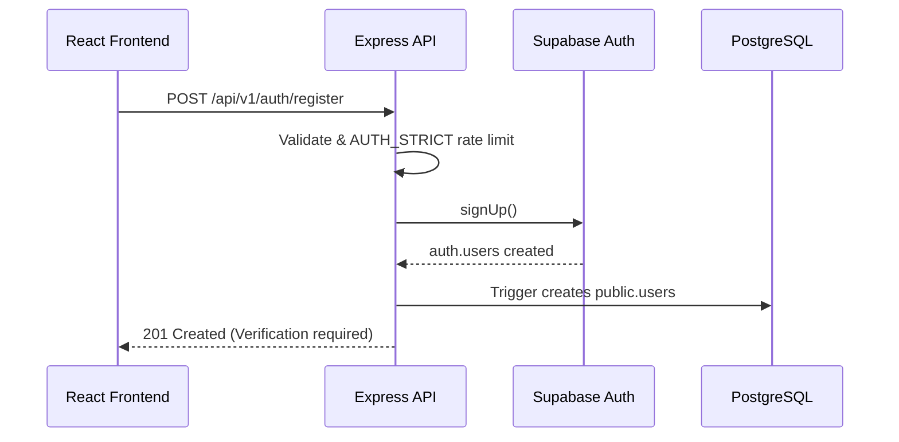
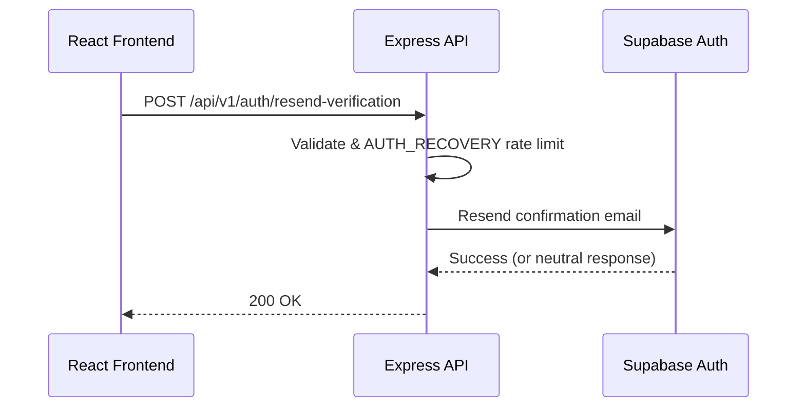
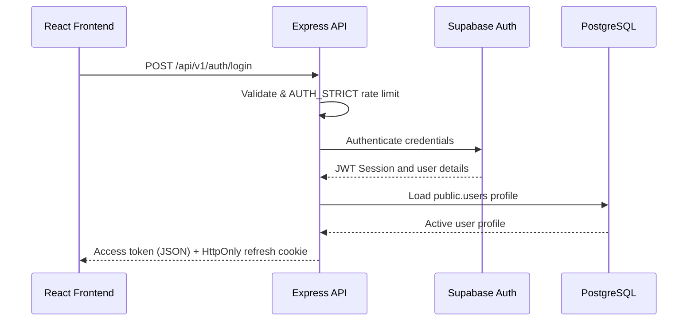
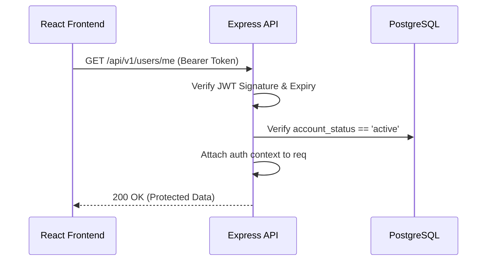
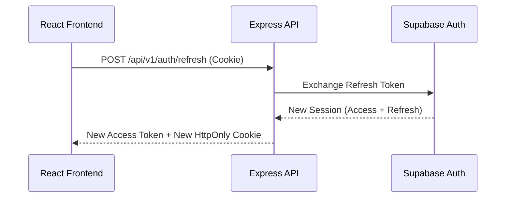
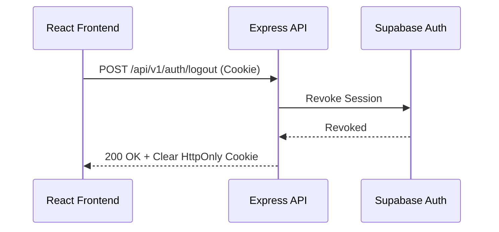
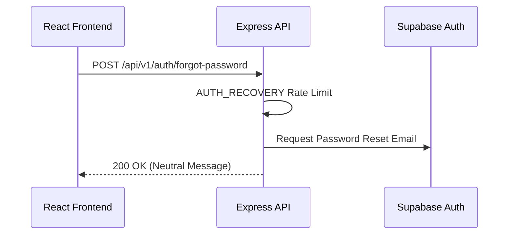
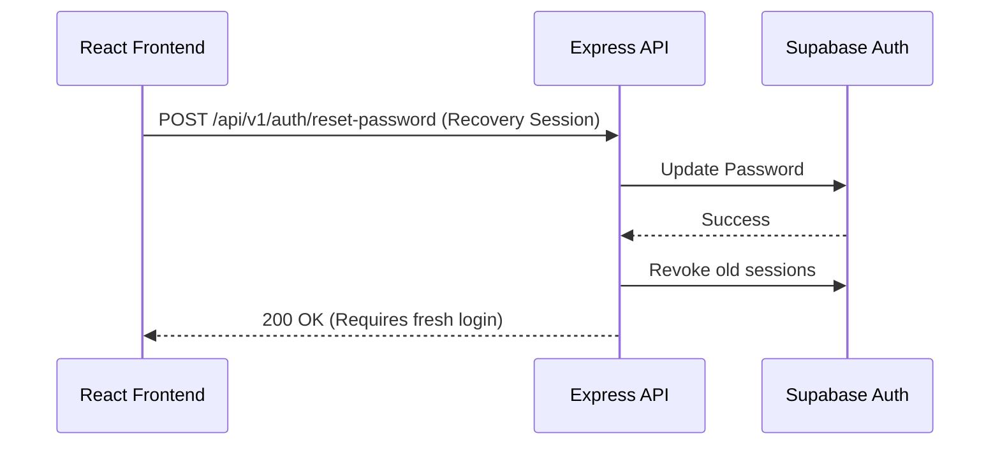
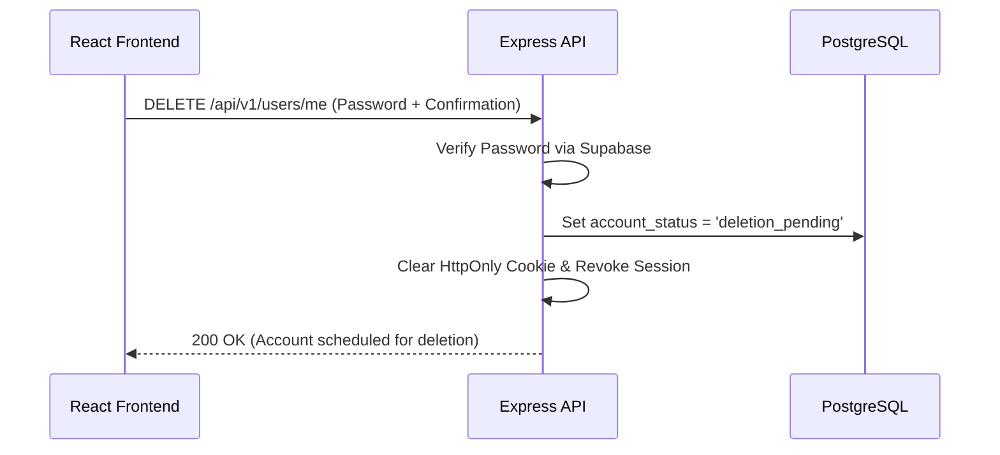

# P1.4 — COMPLETE AUTHENTICATION FLOW DESIGN

## P1.4.1 Authentication Principles and Trust Boundaries

### Principles
* **Supabase Auth owns credentials**: Passwords, email confirmation state, and token lifecycle are strictly managed by Supabase Auth. Express NEVER handles raw passwords (except proxying registration/login payloads), logs tokens, or trusts frontend UUIDs.
* **Express owns application access decisions**: Rate limiting, API validation, profile lookup, status checks (`active` vs `suspended`), and authorization context are purely managed by the Express backend.
* **Authoritative identity**: Identity is derived exclusively from the Supabase verified JWT. The frontend cannot claim identity via body payloads (e.g., `userId: "xyz"`).

### Trust Boundaries
1. **Browser to Express**: Untrusted. Regulated by HTTPS, CORS allowlists, CSRF tokens/SameSite cookies, rate limits, and generic auth failure messages.
2. **Express to Supabase Auth**: Trusted network but strictly partitioned. Operations use the user-scoped client derived from their access token for data access. Service-role clients are restricted to absolute administrative tasks (e.g., syncing profiles) and never exposed.
3. **Access Token to Identity**: Token validation verifies signature, expiry, and issuer. Successful validation is followed by a DB lookup against `public.users` to confirm `account_status`.
4. **Refresh Cookie**: Highly sensitive. Enforced as `HttpOnly, Secure, SameSite=Lax/Strict`. Invisible to frontend JS.
5. **Frontend Route Guards**: UX only. Backend assumes all endpoints are targeted maliciously.

---

## P1.4.2 Identity and Profile Synchronization

**Identity Source**: `auth.users.id` (Supabase Auth).
**Profile Sync Decision**: Database-driven via PostgreSQL Triggers.
* A trigger on `auth.users` creates the baseline `public.users` record immediately upon successful Supabase registration.
* Express gracefully handles edge cases via idempotent fallback logic (if `public.users` is missing during login, a safe recovery function attempts to heal the profile without duplicating).

---

## P1.4.3 Registration Flow

## POST /api/v1/auth/register

**Purpose:**
Registers a new user account on the platform.

**Access classification:**
PUBLIC

**Rate-limit category:**
AUTH_STRICT

**Required headers:**
```text
Content-Type: application/json
```

**Cookie requirements:**
None.

**Request body:**
```json
{
  "email": "student@example.com",
  "password": "strong-password",
  "fullName": "Student Name",
  "college": "Engineering College",
  "branch": "Computer Engineering",
  "graduationYear": 2027
}
```

**Validation rules:**
* Email is trimmed and lowercased. Standard format validation.
* Password minimum 8 characters, maximum 72 chars. No silent trimming.
* `graduationYear` between 2000 and 2100.
* Unknown fields rejected.

**Processing flow:**
1. Validate payload structure and constraints.
2. Apply `AUTH_STRICT` rate limit.
3. Call Supabase Auth `signUp` endpoint.
4. Database trigger intercepts `auth.users` insert and creates `public.users` row.
5. Return generic success message requesting email verification.

**Success response (201 Created):**
```json
{
  "success": true,
  "message": "Registration accepted. Check your email for the next steps.",
  "data": {
    "verificationRequired": true,
    "email": "student@example.com"
  },
  "meta": {
    "requestId": "uuid"
  }
}
```

**Cookies created or cleared:**
None (Session is NOT issued until verified).

**Possible errors:**
| Status | Code | Condition |
| -----: | ---- | --------- |
| 400 | VALIDATION_ERROR | Malformed body |
| 429 | RATE_LIMIT_EXCEEDED | Too many requests |
| 409 | EMAIL_IN_USE | Registration collision |

**Audit event:**
`USER_REGISTERED`

**Frontend behavior:**
Redirect to a "Check Your Email" screen. No application data access allowed.

---

## P1.4.4 Email-Verification Flow

## POST /api/v1/auth/resend-verification

**Purpose:**
Resends the verification email.

**Access classification:**
PUBLIC

**Rate-limit category:**
AUTH_RECOVERY (e.g., 3 requests per 15 minutes)

**Request body:**
```json
{
  "email": "student@example.com"
}
```

**Neutral Response:** Success is returned even if the email doesn't exist to prevent enumeration.

**Unverified User Behavior:**
* Can access `/login` (which will return `EMAIL_NOT_VERIFIED`).
* Can access public features (e.g. landing page).
* Cannot access protected `/api/v1` routes.
* Redirection post-verification uses strict Supabase allowlists (Open-redirect prevention).

---

## P1.4.5 Login Flow

## POST /api/v1/auth/login

**Purpose:**
Authenticates the user and issues session tokens.

**Access classification:**
PUBLIC

**Rate-limit category:**
AUTH_STRICT

**Cookie requirements:**
Creates the secure refresh cookie.

**Request body:**
```json
{
  "email": "student@example.com",
  "password": "strong-password"
}
```

**Processing flow:**
1. Apply `AUTH_STRICT`.
2. Authenticate via Supabase Auth `signInWithPassword`.
3. If failure, return generic `INVALID_CREDENTIALS`.
4. If success, verify `email_confirmed_at` is present.
5. Load `public.users` and check `account_status`. Block if `suspended` or `deletion_pending`.
6. Issue short-lived access token in JSON body and attach `refresh_token` as HTTP-Only cookie.

**Success response:**
```json
{
  "success": true,
  "message": "Login successful.",
  "data": {
    "accessToken": "eyJhbGci...",
    "expiresIn": 3600,
    "user": {
      "id": "uuid",
      "email": "student@example.com",
      "fullName": "Student Name",
      "role": "student",
      "accountStatus": "active",
      "emailVerified": true
    }
  },
  "meta": {
    "requestId": "uuid"
  }
}
```

**Cookies created or cleared:**
| Cookie | Action | Attributes |
| ------ | ------ | ---------- |
| refresh_token | Create | HttpOnly, Secure, SameSite=Strict/Lax, Path=/api/v1/auth |

**Possible errors:**
| Status | Code | Condition |
| -----: | ---- | --------- |
| 401 | INVALID_CREDENTIALS | Wrong email/password |
| 403 | EMAIL_NOT_VERIFIED | Email unconfirmed |
| 403 | ACCOUNT_SUSPENDED | User banned |
| 403 | ACCOUNT_DELETION_PENDING | User scheduled for deletion |

**Audit event:**
`LOGIN_SUCCEEDED` or `LOGIN_FAILED`

---

## P1.4.6 Session and Token Strategy

* **Access Token**: Short-lived (e.g., 1 hour). Returned in JSON. Stored strictly in frontend memory. Sent via `Authorization: Bearer <token>`.
* **Refresh Token**: Long-lived (e.g., 30 days). Sent/stored EXCLUSIVELY as an HTTP-only cookie.
* **Token Expiry**: Handled seamlessly by frontend catching 401, pinging `/refresh`, and retrying original request.

---

## P1.4.7 Access-Token Verification Middleware

**Middleware Flow:**
1. Extract token from `Authorization` header.
2. Validate JWT signature and expiry via Supabase.
3. Fetch `public.users` to confirm `account_status == 'active'`.
4. Inject safe auth context into Express `req.auth`.

**Safe Context Structure (`req.auth`):**
```json
{
  "userId": "uuid",
  "email": "student@example.com",
  "role": "student",
  "accountStatus": "active",
  "emailVerified": true
}
```

---

## P1.4.8 Refresh-Token Rotation and Cookie Design

## POST /api/v1/auth/refresh

**Purpose:**
Exchanges a valid refresh cookie for a new access and refresh token.

**Access classification:**
SESSION_COOKIE_REQUIRED

**Cookie requirements:**
Reads `refresh_token`. Sets new `refresh_token`.

**Success response:** Returns new `accessToken`.

**Concurrent Refresh Strategy:**
If multiple calls fire, Supabase handles rotation. The frontend MUST mutex refresh calls so only one executes, queuing others until the new access token is received. Replaying a rotated refresh token immediately invalidates the entire token family (Supabase native security).

---

## P1.4.9 CSRF and CORS Strategy

**CORS Policy:**
* Explicit frontend origin allowlist.
* `credentials: true` required for cookie exchange.
* Wildcard origins (`*`) rejected.

**CSRF Strategy:**
* `SameSite=Lax` (if frontend and backend share root domain) or `SameSite=None, Secure` (if separated).
* Origin/Referer header validation enforced on `POST /api/v1/auth/refresh` and `POST /api/v1/auth/logout`.

---

## P1.4.10 Logout and Session Revocation

## POST /api/v1/auth/logout

**Purpose:**
Terminates the current session.

**Cookie requirements:**
Reads and clears `refresh_token`.

**Processing flow:**
1. Validate cookie/origin.
2. Call Supabase Auth `signOut` to revoke the session server-side.
3. Clear `refresh_token` cookie.
4. Return idempotent 200 Success.

**Logout-All Devices:** Deferred for V2. Supabase currently supports admin-level session termination, which is complex for a standard endpoint.

---

## P1.4.11 Forgot-Password and Reset-Password

## POST /api/v1/auth/forgot-password
* Apply `AUTH_RECOVERY` limits.
* Response is completely neutral to prevent enumeration.
* Send email containing an approved redirect link.

## POST /api/v1/auth/reset-password
* Requires the active recovery session.
* New password provided, validated.
* Old sessions revoked (where feasible).
* Forces frontend to redirect to a fresh `/login` rather than auto-logging in.

---

## P1.4.12 Account-Status Enforcement

* **active**: Full access.
* **suspended**: Authentication returns `403 ACCOUNT_SUSPENDED`. Refresh fails.
* **deletion_pending**: Normal API fails with `403 ACCOUNT_DELETION_PENDING`. Only deletion cancellation APIs (if supported) are accessible.
* **deleted**: Cannot login.

---

## P1.4.13 Account-Deletion Authentication

**Sensitive Action Authorization**:
* Action requires user to re-authenticate contextually.
* Payload must contain `{"password": "current-password", "confirmation": "DELETE"}`.
* Moves `account_status` to `deletion_pending`, clears sessions, schedules chron worker.

---

## P1.4.14 Roles and Authorization Context

**Roles**: `student`, `admin`.
**Source of Truth**: Derived from `public.users.role`, NEVER `user_metadata` as frontend can manipulate JWT metadata during client-side registration hacks.

---

## P1.4.15 Rate Limiting and Abuse Prevention

* **AUTH_STRICT** (Login/Register): e.g., 5 req / 15 min per IP.
* **AUTH_RECOVERY** (Forgot Password): e.g., 3 req / 60 min per IP/Email.
* **AUTH_REFRESH**: Flexible sliding window.
* **USER_STANDARD**: Baseline API route protection.

---

## P1.4.16 Error and Response Contracts

All errors follow strict envelopes:
```json
{
  "success": false,
  "message": "Safe message.",
  "code": "INVALID_CREDENTIALS",
  "errors": [],
  "meta": { "requestId": "uuid" }
}
```

* `401 INVALID_CREDENTIALS`
* `401 INVALID_TOKEN`
* `403 EMAIL_NOT_VERIFIED`
* `403 ACCOUNT_SUSPENDED`

---

## P1.4.17 Audit Logging

**Logged to `audit_logs`:**
* `USER_REGISTERED`
* `LOGIN_SUCCEEDED` / `LOGIN_FAILED`
* `PASSWORD_RECOVERY_REQUESTED`
* `PASSWORD_RESET_COMPLETED`
* `ACCOUNT_SUSPENDED_ACCESS_BLOCKED`
* `ACCOUNT_DELETION_REQUESTED`

No passwords or tokens are ever logged.

---

## P1.4.18 Frontend Integration Contract

1. **Login**: POST `/login`, store `accessToken` in memory context.
2. **Requests**: Attach `Authorization: Bearer <token>`.
3. **401 Interceptor**:
    * Request fails 401.
    * Mutex locks API calls.
    * POST `/refresh`.
    * Update memory `accessToken`.
    * Retry original failed request.
    * If `/refresh` fails, clear memory and redirect to `/login`.

### Page Reload / Session Restoration
Because the access token is kept only in memory, it disappears after a page reload. The bootstrap sequence is:

1. React application loads.
2. `POST /api/v1/auth/refresh` (with `credentials: "include"`).
3. Receive new access token.
4. `GET /api/v1/auth/session` (using `Authorization: Bearer <token>`).
5. Restore authenticated UI state.

---

## P1.4.19 Authentication Testing Matrix

| Feature | Scenario | Expected Result |
|---|---|---|
| Register | Valid input | 200, DB synced, Email sent |
| Register | Duplicate email | 409 EMAIL_IN_USE |
| Login | Invalid password | 401 INVALID_CREDENTIALS (neutral) |
| Login | Unverified email | 403 EMAIL_NOT_VERIFIED |
| Middleware| Expired token | 401 TOKEN_EXPIRED |
| Refresh | Missing cookie | 401 SESSION_REQUIRED |
| Refresh | Replayed cookie | Supabase revokes token family |
| Account | Suspended user | 403 ACCOUNT_SUSPENDED on protected routes |

---

## P1.4.20 Failure and Recovery Scenarios

* **Auth user exists, Profile missing**: Trigger failed. Login endpoint detects mismatch and executes safe fallback insert.
* **Refresh succeeds but frontend loses response**: Cookie is rotated. Next refresh attempt replays old cookie, triggering family revocation. Frontend detects 401 on refresh and forces user re-login. Safe by design.
* **Password reset session revocation fails**: Fallback forces local logout. Audit event recorded.

---

## P1.4.21 Sequence Diagrams

### 1. Registration


### 2. Email Verification


### 3. Login


### 4. Protected Request


### 5. Token Refresh


### 6. Logout


### 7. Forgot Password


### 8. Reset Password


### 9. Account Deletion


---

## P1.4.22 Authentication ADRs

* **ADR-AUTH-001 — Supabase Auth owns credentials**: Express acts as an orchestrator, never a crypto layer.
* **ADR-AUTH-002 — Access token returned to frontend memory**: Mitigates CSRF for data access.
* **ADR-AUTH-003 — Refresh token stored in HTTP-only cookie**: Protects long-lived tokens from XSS.
* **ADR-AUTH-004 — Express validates application account status**: Database profile dictates functional rights, JWT only dictates cryptographic identity.
* **ADR-AUTH-005 — Frontend user IDs are never trusted**: `req.auth.userId` is strictly decoded server-side.
* **ADR-AUTH-006 — Authentication failures use safe standardized errors**: Prevents stack trace leakage.
* **ADR-AUTH-007 — Recovery endpoints prevent account enumeration**: Neutral success messaging guarantees privacy.
* **ADR-AUTH-008 — Refresh calls use CSRF and origin protection**: Cookie-based endpoints strictly validate origin.
* **ADR-AUTH-009 — Password reset requires a fresh login afterward**: Cleanest state invalidation strategy.
* **ADR-AUTH-010 — Sensitive account deletion requires re-authentication**: Standard security practice against hijacked active sessions.

---

## P1.4.23 Acceptance Checklist

* [x] Supabase Auth responsibility defined
* [x] Express authentication responsibility defined
* [x] Identity source defined
* [x] `auth.users` and `public.users` relationship confirmed
* [x] Trust boundaries documented
* [x] Authentication states documented
* [x] Account states documented
* [x] Registration endpoint documented
* [x] Registration validation documented
* [x] Profile synchronization documented
* [x] Registration failure recovery documented
* [x] Email verification documented
* [x] Verification resend documented
* [x] Verification cooldown documented
* [x] Login endpoint documented
* [x] Login error privacy documented
* [x] Session response documented
* [x] Access-token storage strategy documented
* [x] Refresh-token storage strategy documented
* [x] Refresh rotation documented
* [x] Concurrent refresh behavior documented
* [x] Secure cookie attributes documented
* [x] Development cookie behavior documented
* [x] Production cookie behavior documented
* [x] CSRF strategy documented
* [x] CORS strategy documented
* [x] Access-token middleware flow documented
* [x] Safe request authentication context documented
* [x] Session endpoint documented
* [x] Logout documented
* [x] Idempotent logout documented
* [x] Logout-all decision documented
* [x] Forgot-password flow documented
* [x] Account-enumeration prevention documented
* [x] Reset-password flow documented
* [x] Recovery-session validation documented
* [x] Password policy documented
* [x] Password-reset session invalidation documented
* [x] Suspended-account handling documented
* [x] Deletion-pending handling documented
* [x] Deleted-account handling documented
* [x] Account-deletion re-authentication documented
* [x] Role source documented
* [x] Role trust boundary documented
* [x] Multiple-device session strategy documented
* [x] Rate-limit categories documented
* [x] Error codes documented
* [x] HTTP status mapping documented
* [x] Audit events documented
* [x] Frontend login integration documented
* [x] Frontend refresh integration documented
* [x] Frontend logout integration documented
* [x] Frontend 401 retry rule documented
* [x] Frontend 403 handling documented
* [x] Authentication test matrix included
* [x] Failure-recovery scenarios documented
* [x] Sequence diagrams included
* [x] Authentication ADRs included
* [x] No unresolved authentication-design blockers remain
