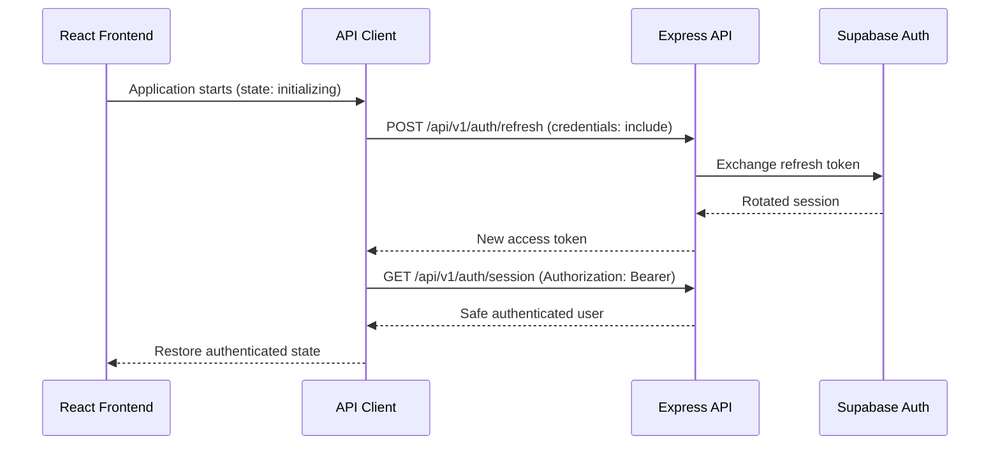
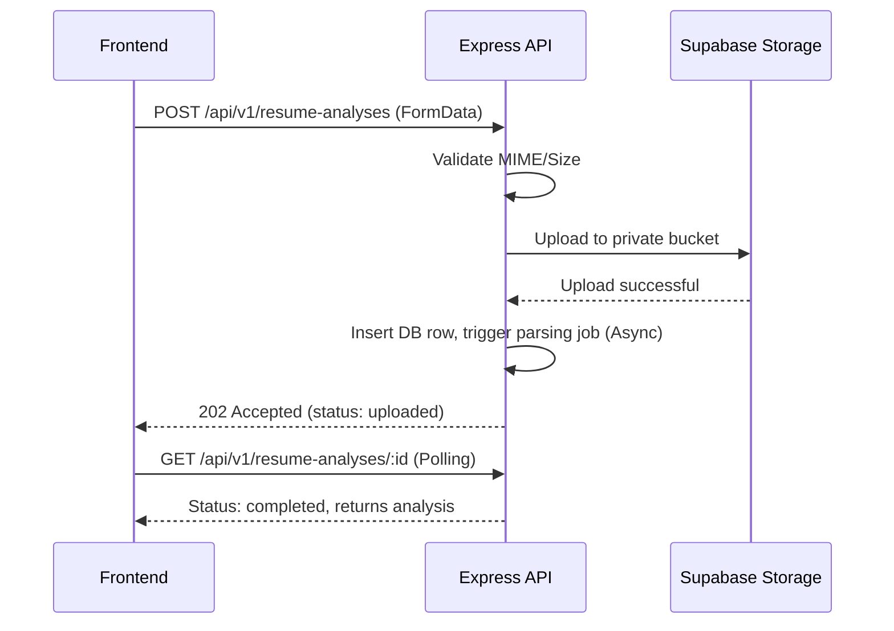

# P1.7 — Frontend Integration Contract

## 1. Integration Principles

### 1.1 Backend contract is authoritative
The Express API is authoritative for:
* Authentication state
* User identity
* Account status
* User role
* Resource ownership
* Interview state
* Scores
* Evaluations
* Resume-analysis results
* Progress values
* Feedback
* Validation results
* Authorization
* Storage access
* Error codes

The frontend must not calculate or override authoritative backend values.

### 1.2 Frontend validation is for user experience
The frontend may validate:
* Required fields
* Email shape
* Password confirmation
* Character limits
* Accepted file type
* File size
* Numeric ranges

Backend validation remains mandatory and authoritative.

### 1.3 One API client boundary
All HTTP communication should pass through one frontend API-client layer. React components must not create inconsistent, duplicated `fetch` logic.
The future API layer may include:
* `apiClient`
* `authApi`
* `usersApi`
* `questionsApi`
* `interviewsApi`
* `resumeApi`
* `progressApi`
* `feedbackApi`
* `adminApi`

### 1.4 Typed data contracts
Frontend request and response types must match the approved API blueprint. Do not create frontend-only variations of backend enums without a shared mapping strategy.

### 1.5 Safe failure behavior
The frontend must:
* Display safe backend messages
* Use backend error codes for control flow
* Avoid showing raw stack traces
* Avoid showing Supabase errors directly
* Avoid guessing whether a hidden resource exists
* Clear authentication state when session restoration fails

---

## 2. API Environment Configuration

The frontend must not hard-code production URLs inside components.

**Environment variable configuration:**
```javascript
const API_BASE_URL = `${import.meta.env.VITE_API_BASE_URL}/api/v1`;
```
Configurations for environments:
* **Local development:** `http://localhost:5000`
* **Preview / Staging / Production:** Provided via CI/CD.

### Environment Variable Ownership Matrix

| Variable | Target Environment | Visibility | Purpose |
| -------- | ------------------ | ---------- | ------- |
| `VITE_API_BASE_URL` | Frontend | Exposable | Define the backend API route. |
| `VITE_APP_ENV` | Frontend | Exposable | To separate analytics tracking or display banners. |
| `VITE_SUPPORT_EMAIL` | Frontend | Exposable | Contact email for error boundaries. |
| `SUPABASE_SERVICE_ROLE_KEY`| Backend | Server-only| Bypasses RLS, never shared. |
| `GEMINI_API_KEY` | Backend | Server-only| Model inference API. |
| `OPENAI_API_KEY` | Backend | Server-only| Model inference API. |
| `DATABASE_URL` | Backend | Server-only| PostgreSQL connection. |

*The frontend must never receive backend-only keys.*

---

## 3. Request-Client Architecture

The future frontend request client must support standard operations and remain library-independent (compatible with `fetch`, `Axios`, `TanStack Query`, etc.).

**Example Interface:**
```typescript
type ApiRequestOptions = {
  method?: "GET" | "POST" | "PATCH" | "DELETE";
  body?: unknown;
  query?: Record<string, string | number | boolean | undefined>;
  accessToken?: string;
  credentials?: RequestCredentials;
  idempotencyKey?: string;
  signal?: AbortSignal;
};
```

---

## 4. Headers, Cookies, CORS, and CSRF

### 4.1 Required Headers
**JSON requests:**
```text
Content-Type: application/json
Accept: application/json
```
**Protected requests:**
```text
Authorization: Bearer <access-token>
```
**Optional request ID:**
```text
X-Request-ID: <uuid>
```
*(The backend may replace malformed or unsafe client request IDs.)*

**Idempotency-protected requests:**
```text
Idempotency-Key: <uuid>
```

### 4.2 Multipart Uploads
Do not manually set the multipart boundary. The browser must create the correct `Content-Type` header when using `FormData`.
**Correct:**
```javascript
const formData = new FormData();
formData.append("resume", file);
```

### 4.3 Cookie and Credential Requirements
Refresh tokens are stored in HTTP-only cookies. Frontend JavaScript must never read or write the refresh token. Cookie-consuming requests must use `credentials: "include"`.
At minimum:
* `POST /api/v1/auth/login`
* `POST /api/v1/auth/refresh`
* `POST /api/v1/auth/logout`

*The frontend must not store refresh tokens in localStorage, sessionStorage, IndexedDB, or React state.*

### 4.4 CORS Contract
The backend will use a strict frontend-origin allowlist.
Required rules:
* No wildcard origin when credentials are enabled
* Exact production origin
* Approved preview origins only
* Approved local development origin
* `credentials: "include"` for cookie requests
* Only approved HTTP methods and headers

*A CORS error is not a normal API error response and may appear as a browser network failure. The frontend should display a safe connectivity message.*

### 4.5 CSRF Contract
Cookie-authenticated operations require CSRF protection.
The contract must support:
* SameSite cookie policy
* Origin validation
* Referer validation where required
* Strict CORS allowlist
* CSRF token/header if required by deployment topology (e.g. `X-CSRF-Token: <csrf-token>`).

---

## 5. Authentication Bootstrap and Session Restoration

### Authentication State Model
The frontend must distinguish between the following states rather than a simple Boolean:
* `initializing`
* `unauthenticated`
* `refreshing`
* `authenticated`
* `email_unverified`
* `suspended`
* `deletion_pending`
* `session_expired`
* `authentication_error`

### Page Reload and Session Restoration

**Bootstrap Sequence:**

If refresh returns a session error, transition to `unauthenticated`, clear private cached data, and render public routes.
If refresh fails because of network connectivity, transition to `authentication_error` to allow retry. Do not immediately treat the user as permanently logged out.

### Access-Token Storage
The access token must be stored in frontend memory (e.g., React Context, Zustand in-memory store).
It must not be persisted indefinitely in `localStorage` or `sessionStorage`. The frontend must assume the access token disappears after page reload, browser restart, hard navigation, or app crash. Session restoration uses the refresh cookie.

---

## 6. Access-Token Refresh and Retry Behavior

### Concurrent Refresh Strategy
When several requests receive `401` simultaneously, the frontend must make only one refresh request.
**Required behavior:**
```text
Request A receives 401
Request B receives 401
Request C receives 401
        ↓
One shared refresh promise starts
        ↓
Other requests wait
        ↓
Refresh succeeds
        ↓
All requests retry once using new token
```
**Rules:**
* Only one active refresh request
* Queue pending protected requests
* Retry each original request at most once
* Do not refresh `/auth/login` or `/auth/refresh`
* Clear authentication state when refresh fails
* Replace the in-memory token atomically

### Request Retry Rules
**Automatically retry once allowed only when:**
* Protected request returned `401`
* Refresh succeeded
* Original request has not already been retried
* Request is safe to retry

**Do not automatically retry:**
* Login, Registration, Password reset
* Account deletion
* Resume upload
* AI operations without an idempotency key
* Validation failures, authorization failures, or conflict errors

---

## 7. Standard Success and Error Contracts

### Standard Success Envelope
```json
{
  "success": true,
  "message": "Interview created successfully.",
  "data": {},
  "meta": {
    "requestId": "uuid"
  }
}
```
The frontend must read business data from `response.data`.

### Collection Response
```json
{
  "success": true,
  "data": [],
  "pagination": {
    "page": 1,
    "limit": 20,
    "totalItems": 100,
    "totalPages": 5,
    "hasNextPage": true,
    "hasPreviousPage": false
  },
  "meta": {
    "requestId": "uuid"
  }
}
```
An empty collection (`data: []`) is safely handled and normally not an error.

### Standard Error Envelope
```json
{
  "success": false,
  "message": "Request validation failed.",
  "code": "VALIDATION_ERROR",
  "errors": [
    {
      "field": "difficulty",
      "message": "Difficulty must be easy, medium, or hard."
    }
  ],
  "meta": {
    "requestId": "uuid"
  }
}
```

**Frontend Error Model:**
```typescript
type ApiError = {
  status: number;
  code: string;
  message: string;
  fieldErrors?: Record<string, string[]>;
  requestId?: string;
  retryable: boolean;
};
```
The frontend must preserve the backend request ID for debugging but must not display raw stack traces, Supabase/PG/AI errors, or internal object paths to the user.

---

## 8. HTTP Status Handling

* **`200 OK`**: Display or apply returned data.
* **`201 Created`**: Resource created successfully (registration, interviews, responses, resume records).
* **`202 Accepted`**: Background processing. Show processing status. Poll only when required. Do not treat as completed.
* **`204 No Content`**: Do not attempt JSON parsing unless API contract says otherwise.
* **`400 Bad Request`**: General request error.
* **`401 Unauthorized`**: Attempt one token refresh for protected routes. (Do not refresh if login failed, refresh failed, or request is already retried).
* **`403 Forbidden`**: Do not retry through refresh. Map to errors like `EMAIL_NOT_VERIFIED`, `ACCOUNT_SUSPENDED`, `ACCOUNT_DELETION_PENDING`.
* **`404 Not Found`**: Show safe not-found state. Do not infer if another user owns the resource.
* **`409 Conflict`**: Handle duplicate resource, idempotency conflict, already-completed operations, or stale state.
* **`413 Payload Too Large`**: Show resume size guidance.
* **`415 Unsupported Media Type`**: Show accepted file types.
* **`422 Unprocessable Entity`**: Map field or business-validation errors.
* **`429 Too Many Requests`**: Display rate-limit messaging and use `Retry-After`.
* **`500 Internal Server Error`**: Generic server error with request ID.
* **`502 Bad Gateway`**: External-provider temporary failure.
* **`503 Service Unavailable`**: Temporary unavailability and a safe retry option.

### Error-Code Handling Matrix

| Error code | HTTP status | Frontend action | Retry | User message source |
| ---------- | ----------: | --------------- | ----: | ------------------- |
| `VALIDATION_ERROR` | 422 | Show field errors | No | API errors array |
| `INVALID_CREDENTIALS` | 401 | Show login error | No | API message |
| `EMAIL_NOT_VERIFIED` | 403 | Prompt verification | No | Frontend copy |
| `TOKEN_EXPIRED` | 401 | Attempt refresh | Yes | Internal log |
| `ACCOUNT_SUSPENDED` | 403 | Show suspension page| No | Frontend copy |
| `FORBIDDEN` | 403 | Return safe generic message | No | API message |
| `RESOURCE_NOT_FOUND` | 404 | Show 404 page | No | Frontend copy |
| `RESOURCE_CONFLICT` | 409 | Inform user of conflict | No | API message |
| `AI_PROVIDER_UNAVAILABLE` | 502 | Show AI downtime | Yes | Frontend copy |
| `INTERNAL_SERVER_ERROR` | 500 | Show generic error | No | Frontend copy |

---

## 9. Naming, Identifiers, Dates, and Null Semantics

### Field Naming
API fields use camel case (e.g., `userId`, `accountStatus`, `createdAt`). The frontend must not expect snake-case database names.

### UUID Contract
All public resource IDs use UUID strings (e.g. `31529c8f-8db4-4e69-a204-79b3c83c8995`).
* Treat UUIDs as opaque strings.
* Do not parse business information from UUIDs.
* Validate route IDs before sending when practical.

### Date and Time Contract
API timestamps use ISO 8601 UTC (e.g. `2026-07-21T10:30:00.000Z`).
* Frontend parses ISO strings.
* Display in user-local time where appropriate.
* Preserve UTC for API requests.
* Use absolute timestamps for persisted values. Date-only fields (e.g. graduation year) must not be treated as UTC timestamps.

### Null, Empty, and Omitted Values
* **Omitted field:** Means "Do not change the existing value" (common in `PATCH`).
* **Explicit `null`:** Means "Clear the value" (only when clearing is allowed).
* **Empty string:** Must not automatically mean `null`.
* **Empty array:** Means an intentionally empty collection. The frontend must not send `undefined` inside JSON.

---

## 10. Pagination, Filtering, Sorting, and Search

### Pagination Contract
* Default request: `page=1`, `limit=20`. Maximum limit: `100`.
* Changing filters normally resets page to 1.
* Empty final pages must be handled safely.
* Do not infer total pages from array length.

### Filtering Contract
* Use approved query parameters (e.g. `category=technical&difficulty=medium`).
* Send only approved filters, omit undefined ones, URL-encode values.
* Reset pagination when filters change.

### Sorting Contract
* Use `sortBy=createdAt` and `sortOrder=desc` (`asc` | `desc`).
* Send only allowlisted fields.

### Search Contract
* Use `search=javascript`.
* Define minimum/maximum search length and debounce duration recommendation.
* Case-insensitive backend behavior.
* Cancel outdated searches using `AbortController`.

---

## 11. Idempotency-Key Integration

The frontend must generate a UUID idempotency key for approved operations.
Header: `Idempotency-Key: <uuid>`

**Operations requiring keys:**
* Start interview
* Submit answer
* Complete interview
* Upload resume
* Retry resume analysis
* Regenerate feedback

**Rules:**
* One logical user action gets one key.
* Reuse the same key when retrying the same payload.
* Generate a new key for a genuinely new action.
* Do not reuse a key with a modified payload.
* Storage scope: In-memory action state or temporary component state.

---

## 12. Authentication API Integration

* `POST /api/v1/auth/register`: Frontend sends profile fields/password. On `201 Created`, display verification screen (do not treat as authenticated).
* `POST /api/v1/auth/login`: Uses `credentials: "include"`. On success, store access token in memory, navigate to app.
* `POST /api/v1/auth/refresh`: Uses `credentials: "include"`. Replaces access token.
* `POST /api/v1/auth/logout`: Calls backend with credentials. Clears local state, private cached data, redirects to login. Idempotent.
* `POST /api/v1/auth/forgot-password`: Always display neutral language.
* `POST /api/v1/auth/reset-password`: Clears authentication state after success, requiring fresh login.

---

## 13. User-Profile API Integration

**Approved Routes:**
`GET /api/v1/users/me`, `PATCH /api/v1/users/me`, `DELETE /api/v1/users/me`

**Writable Fields:**
`fullName`, `college`, `branch`, `graduationYear`, `experienceLevel`, `preferredRoles`, `bio`, `avatarUrl`

**Account Deletion:**
Must require explicit confirmation, collect re-auth, send no `userId`, clear session on success, and display deletion-pending status.

---

## 14. Question-Bank API Integration

**Approved Routes:**
`GET /api/v1/questions`, `GET /api/v1/questions/:questionId`, `GET /api/v1/questions/categories`

The frontend must not expect protected fields such as `referenceAnswer`, `internalEvaluationNotes`, `rawExpectedKeywords` unless an endpoint explicitly authorizes them.

---

## 15. Interview API Integration

**Interview States:**
`draft`, `generating`, `ready`, `in_progress`, `completed`, `cancelled`, `failed`

**Starting an Interview:**
Use an idempotency key. Handle generating state, network timeout, and retry with the same key.

**Completing an Interview:**
* Disable duplicate completion actions.
* Use idempotency key.
* Show completion processing.
* Refresh interview, feedback, and progress state after success.

---

## 16. Response and AI-Evaluation Integration

**Submission Behavior:**
* Answer request includes `questionId`, `answerText`, `timeSpentSeconds`.
* Disable repeated submit button clicks.
* Generate idempotency key.
* Preserve answer text until success.
* Do not send `userId`, `score`, `evaluationStatus`, or `model`.

**Evaluation Model:**
Frontend must validate display safety but not recalculate scores from arrays.

---

## 17. Resume-Analysis Integration

**Upload Rules:**
* Use `FormData`. Do not send `storagePath`, `userId`, `score`, etc.
* Pre-validate file extension, MIME type, and 5MB size.
* Handle upload progress natively via Axios/XHR if possible.
* States: `uploaded`, `extracting`, `analyzing`, `completed`, `failed`, `deleted`.

**Sequence Diagram:**


---

## 18. Progress and Analytics Integration

Frontend must not submit or calculate authoritative scores, attempt counts, or trends. Frontend may transform backend data only for display (chart points, percent formatting, localized dates). Document empty-state handling gracefully.

---

## 19. Feedback Integration

**Regeneration Requires:**
* Idempotency key
* Loading state
* Rate-limit handling
* Refresh of current feedback after success

The frontend must not send or modify `version`, `isCurrent`, `provider`, `model`, `promptVersion`, or `userId`.

---

## 20. Admin API Integration

The frontend must never infer admin permission only from client state. The backend must authorize every admin request. Admin frontend may use safe role state only to show/hide navigation.
Admin UI must not expose authentication secrets, raw AI provider payloads, unapproved resume contents, or editable audit logs.

---

## 21. Loading, Retry, Cancellation, and Error UX

Each module must define states: `initial`, `loading`, `success`, `empty`, `error`, `refreshing`, `submitting`, `processing`, `retrying`.
Use request cancellation (`AbortController`) for search, filter changes, route changes, component unmounts, and long-running GET requests.
Error components should display safe messages and retry actions, never technical stack traces.

---

## 22. Cache and State-Invalidation Strategy

* **Invalidate after profile update:** `profile`, `session`
* **Invalidate after starting interview:** `interviews`, `interview:{id}`, `interview:{id}:questions`
* **Invalidate after completing interview:** `interviews`, `interview:{id}`, `interview:{id}:feedback`, `progressSummary`, `progressSkills`, `progressHistory`
* **On logout:** Clear all private user-specific cache immediately.

---

## 23. Frontend-Safe Data Models
Models such as `UserProfile`, `Question`, `Interview`, `ResponseEvaluation`, and `ResumeAnalysis` must be strictly typed, exposing only API-safe enum values and ISO date strings. Do not expose database-only models directly.

---

## 24. Forbidden Frontend Data and Operations

**Forbidden Fields Matrix:**
The frontend must never submit:
`userId`, `role`, `accountStatus`, `emailVerified`, `overallScore`, `technicalAccuracy`, `communicationScore`, `completenessScore`, `evaluationStatus`, `provider`, `model`, `promptVersion`, `isCurrent`, `createdAt`, `updatedAt`, `deletedAt`, `storagePath`, `storageBucket`, `fileHash`, `auditMetadata`, `requestHash`, `responseBody`, `failureCode`.

---

## 25. Mock API and Parallel-Development Strategy

Define a mock strategy using Mock Service Worker (MSW) or static fixtures. Mock responses must use the exact approved envelopes and field names. Do not let mock-only fields enter production models. Switch between modes using environment configuration.

---

## 26. Integration Testing Matrix

* **API-client:** JSON serialization, Auth header, credential inclusion, Error parsing.
* **Authentication:** Successful login, invalid credentials, refresh success/failure, concurrent mutex, logout cleanup.
* **Profile:** Safe update fields, forbidden fields omitted, account deletion confirmation.
* **Interview:** Start idempotency, valid transition, complete idempotency, cache invalidation.
* **Resume:** Valid PDF, unsupported type, file too large, analysis polling.
* **Security:** Refresh token inaccessible to JS, no owner ID sent, CORS failure handling.

---

## 27. Failure and Recovery Scenarios

* **Backend unavailable during bootstrap:** Show connectivity state, allow retry, do not erase session immediately.
* **Refresh token expired:** Clear private state, navigate to login.
* **Interview start times out:** Retry with same idempotency key.
* **Answer submission times out:** Preserve answer, retry with same key.
* **AI evaluation fails:** Show safe failure, allow approved retry.
* **Account suspended during session:** Handle `403 ACCOUNT_SUSPENDED`, clear operational state, show suspension page.

---

## 28. Security Checklist

* [ ] Access tokens stored only in memory
* [ ] Refresh token inaccessible to JavaScript
* [ ] Strict credential inclusion only where needed
* [ ] No service-role key or AI API key in bundle
* [ ] No frontend owner-ID authority or score authority
* [ ] Safe route guards and backend authorization on protected operations
* [ ] Private cache clearing on logout
* [ ] Idempotency keys used for retryable writes
* [ ] CORS and CSRF compliance integrated
* [ ] Must not log passwords, tokens, full resumes, or sensitive analytics

---

## 29. Integration Decision Records (ADRs)

* **ADR-FE-001 — Use one centralized API-client boundary**
* **ADR-FE-002 — Store access tokens only in memory**
* **ADR-FE-003 — Keep refresh tokens in HTTP-only cookies**
* **ADR-FE-004 — Use a single refresh mutex**
* **ADR-FE-005 — Retry protected requests at most once**
* **ADR-FE-006 — Use backend error codes for control flow**
* **ADR-FE-007 — Treat frontend validation as non-authoritative**
* **ADR-FE-008 — Generate idempotency keys per logical action**
* **ADR-FE-009 — Never send authoritative owner or score fields**
* **ADR-FE-010 — Treat UI states gracefully without bypassing backend logic**

---

## 30. Acceptance Checklist

* [x] Integration principles defined
* [x] API environment configuration documented
* [x] Request-client architecture defined
* [x] Headers, cookies, CORS, and CSRF rules set
* [x] Authentication bootstrap and session restoration modeled
* [x] Access-token refresh and retry behavior established
* [x] Standard success and error contracts provided
* [x] HTTP status handling mapped
* [x] Naming, identifiers, dates, and null semantics specified
* [x] Pagination, filtering, sorting, and search behaviors defined
* [x] Idempotency-key integration required
* [x] Authentication API integration detailed
* [x] User-profile API integration detailed
* [x] Question-bank API integration detailed
* [x] Interview API integration detailed
* [x] Response and AI-evaluation integration detailed
* [x] Resume-analysis integration detailed
* [x] Progress and analytics integration detailed
* [x] Feedback integration detailed
* [x] Admin API integration detailed
* [x] Loading, retry, cancellation, and error UX documented
* [x] Cache and state-invalidation strategy specified
* [x] Frontend-safe data models defined
* [x] Forbidden frontend data and operations matrix provided
* [x] Mock API strategy established
* [x] Integration testing matrix included
* [x] Failure and recovery scenarios addressed
* [x] Security checklist provided
* [x] Integration decision records (ADRs) recorded
* [x] Acceptance checklist complete
